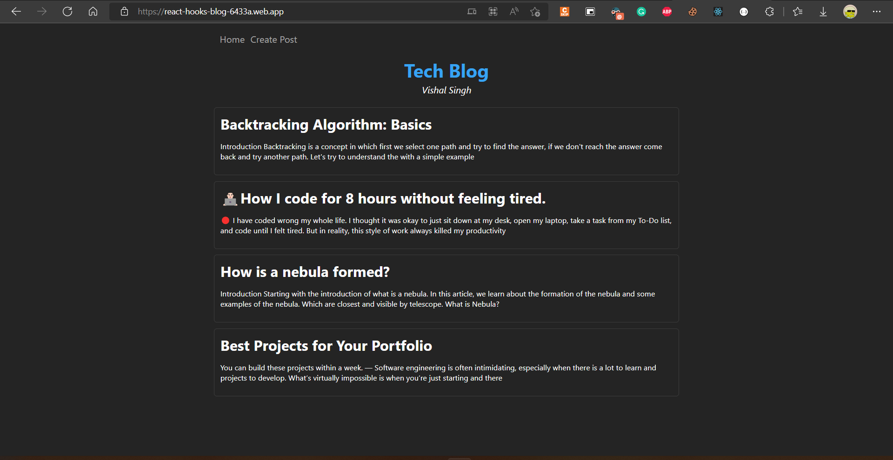
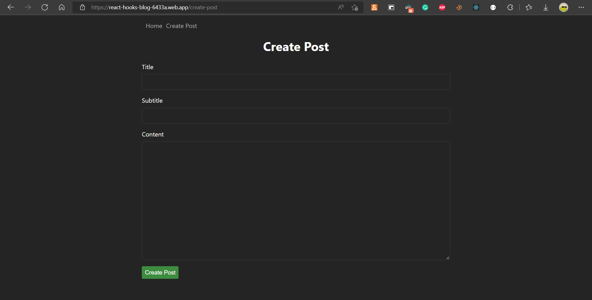

## Hosted Link -- https://react-hooks-blog-6433a.web.app/

### Description

in this project I have created a blog page, where we can create a new blog on a create blog page, and all the blog created previously visible on home screen, and by clicking on any blog it will show the detail/content of the blog.
the main motive of this project to learn rect hooks and routes.

## Folder Structure

```
react-hooks-blog
├─ .gitignore
├─ .prettierrc
├─ package-lock.json
├─ package.json
├─ public
│  ├─ favicon.ico
│  ├─ index.html
│  ├─ logo192.png
│  ├─ logo512.png
│  ├─ manifest.json
│  └─ robots.txt
├─ README.md
└─ src
   ├─ components
   │  ├─ App.js
   │  ├─ CreatePost.js
   │  ├─ Home.js
   │  ├─ index.js
   │  ├─ Navbar.js
   │  └─ PostDetail.js
   ├─ hooks.js
   ├─ index.css
   └─ index.js

```

### Some ScreenShots of Project



